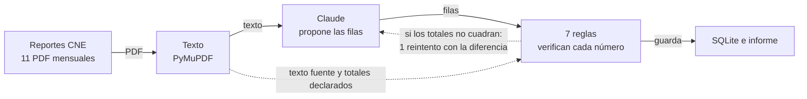

# Vigía ERNC

Un agente lee los reportes mensuales ERNC de la Comisión Nacional de Energía (CNE), extrae los proyectos que entran a evaluación ambiental y los que se aprueban, y siete reglas verifican cada número antes de guardarlo. El resultado es una base SQLite, un informe y fichas de proyectos para el área comercial.

**El modelo propone, las reglas verifican.**

## Ver la demo

- **Escritorio** ([fruiz-01.github.io/vigia-ernc](https://fruiz-01.github.io/vigia-ernc/)): el proyecto dentro de un escritorio Windows en el navegador. Abre con el diagrama del flujo, donde cada caja lleva a su parte; PowerShell reproduce la salida grabada de cada orden; el verificador muestra el texto de cada página del PDF junto a lo que extrajo el modelo y el resultado de cada regla.
- **Informe** ([fruiz-01.github.io/vigia-ernc/informe.html](https://fruiz-01.github.io/vigia-ernc/informe.html)): proyectos, verificación por edición y fichas.

Ambas páginas se generan desde la corrida real y no necesitan servidor.

## Qué hace



Las reglas reciben dos entradas: lo que propone el modelo y el texto fuente con los totales que declara el propio reporte. Si los totales no cuadran, el modelo reintenta una vez con la diferencia concreta.

| Paso | Qué hace |
|---|---|
| `descargar` | Baja el PDF de cada mes desde `cne.cl`, guarda su huella SHA-256 y registra las ediciones que no existen. |
| `extraer` | Ubica las dos páginas con tablas, saca su texto con PyMuPDF y se lo entrega al modelo, que devuelve filas con un esquema fijo (Pydantic). Si los totales o el conteo no cuadran, reintenta una vez con la diferencia concreta. Cada respuesta queda en `datos/extracciones/`. |
| `validar` | Aplica las siete reglas y guarda filas, texto fuente y controles en `datos/vigia.sqlite`. |
| `publicar` | Escribe `docs/informe.html`. |

Por qué un modelo y no un lector fijo: las tablas no salen limpias del PDF. Los nombres vienen partidos en varias líneas, con guiones de corte («CANDE-» + «LARIA»), y el formato cambia entre meses (fechas «30-09- 2025» en octubre de 2025, «19/08/2026» en septiembre de 2026).

Por qué un flujo fijo y no un agente autónomo: la tarea tiene pasos conocidos. Un flujo con un solo punto de autocorrección es más barato, predecible y fácil de auditar.

### Las siete reglas

| Regla | Qué revisa | Si falla |
|---|---|---|
| Totales | La suma de MW y MMUSD coincide con lo que declara el texto del reporte | Error |
| Conteo | El número de filas coincide con los proyectos declarados | Error |
| Evidencia | Cada valor extraído aparece escrito en la página | Error (posible invento del modelo) |
| Fecha | La fecha cae en el mes que cubre la edición | Error |
| Rango | MW > 0 e inversión por MW entre 0,3 y 3 MMUSD | Aviso |
| Faltante | Un dato «-» en la fuente queda vacío, nunca en cero | Aviso |
| Duplicado | Un proyecto no se repite en la misma etapa | Aviso |

## Resultados de esta corrida

Ediciones de octubre de 2025 a septiembre de 2026.

| | |
|---|---|
| Reportes leídos | 11 de 12 (mayo de 2026 no está publicado: HTTP 404) |
| Filas | 113: 49 ingresos a evaluación y 64 aprobaciones. Sin las 4 filas que la fuente repite: 47 ingresos (4.937 MW) y 62 aprobaciones (7.417 MW) |
| Controles | 154: 137 ok, 12 avisos, 5 errores |
| Reintentos del modelo | 0: las 11 ediciones cuadraron al primer intento |
| Precisión | 216 de 216 campos correctos contra la transcripción de referencia (octubre 2025 y septiembre 2026, 27 filas) |

### Qué encontraron las reglas

Ninguno de los 5 errores es un error de lectura del modelo:

- **Junio y julio de 2026 repiten las tablas de abril** (4 errores de fecha y 2 avisos de duplicado). Las páginas de tablas de ambas ediciones traen los mismos proyectos, con fechas de abril. La fuente no tiene tablas de mayo ni de junio de 2026.
- **Errata en el PDF de abril de 2026** (1 error de evidencia). El texto dice «suman 3 13 MW». El modelo leyó 313, que es lo que suman las filas (172 + 128 + 13), pero la regla busca el número escrito tal cual y no lo encuentra. Es un falso positivo: se deja a la vista y no se corrige a mano.

Los avisos:

- **6 faltantes**: proyectos con potencia o inversión «-» en la fuente. Quedan vacíos.
- **4 de rango**: inversiones por MW fuera de 0,3–3 MMUSD. Son plausibles (una minicentral hidroeléctrica a 8 MMUSD/MW, una planta de hidrógeno verde a 4,2) y el rango se puede afinar por tecnología.

Otras inconsistencias de la fuente, transcritas tal cual: «Parque Eólico Las Lilas» viene con tecnología «Solar - PV», y la región aparece como «Interregional» o «Inter-region» según la edición (la base la guarda tal cual; el informe las agrupa como «Interregional»).

### Un ajuste que salió de la corrida

El esquema exigía un número en la inversión. En diciembre de 2025 un proyecto trae la inversión «-», y con ese esquema el modelo se habría visto forzado a inventar un valor. Ahora la inversión admite vacío, igual que la potencia, y la regla de faltantes revisa ambos campos (con prueba incluida).

## Cómo se hizo la lectura en esta versión

El código llama a la API de Anthropic con `client.messages.parse` (modelo `claude-opus-5-5`, salida validada con el esquema Pydantic). Para esta corrida no había clave de API, así que la lectura la hizo el mismo modelo a través de Claude Code: cada edición recibió exactamente el mensaje que arma `extraer.armar_mensaje()`, sin acceso a las referencias de prueba, y cada respuesta se validó con el mismo esquema y las mismas reglas de reintento antes de guardarse. Cada archivo de `datos/extracciones/` lo indica en su campo `via`.

Con `ANTHROPIC_API_KEY` definida y la carpeta `datos/extracciones/` vacía, `python -m vigia extraer` hace las llamadas por la API. Costo estimado: 11 llamadas de unos 3.000 tokens de entrada, menos de 1 dólar por corrida.

## Cómo correrlo

Requiere Python 3.13.

```
pip install -r requirements.txt
python -m vigia todo          # descargar, extraer, validar y publicar
python -m vigia precision     # compara con las referencias de tests/datos
python -m vigia sql "SELECT regla, resultado, COUNT(*) FROM controles GROUP BY 1, 2"
python -m vigia escritorio    # graba las órdenes y regenera docs/index.html
pytest -q
```

Sin clave de API, `todo` usa las extracciones guardadas: la verificación se puede repetir sin costo.

## Estructura

```
vigia/
  descargar.py    PDF de la CNE con su huella
  leer.py         ubica las páginas con tablas por su contenido
  extraer.py      esquema, mensaje al modelo y reintento
  validar.py      las siete reglas
  base.py         SQLite: reportes, páginas, filas, controles y vista de proyectos
  publicar.py     informe HTML
  escritorio.py   escritorio de demostración (plantilla en escritorio.html)
  precision.py    comparación campo por campo
tests/            31 pruebas y referencias transcritas del PDF
datos/extracciones/   respuestas del modelo (caché)
docs/             páginas publicadas
```

## Límites y siguiente paso

- Una sola fuente. Lo siguiente sería sumar el detalle de cada proyecto en el SEA (MWh de baterías, punto de conexión, fecha de operación) y el Coordinador Eléctrico, que tiene API oficial.
- Las fichas usan un criterio supuesto (RCA aprobada, con baterías, entre 20 y 300 MW). Es para conversar con el área comercial, no una recomendación.
- La regla de evidencia es literal: prefiere marcar de más (como la errata de abril) a dejar pasar un valor inventado.
- Corre con un comando; programarlo cada mes es una línea de cron.

---

Francisco Ruiz · Ingeniero Civil Industrial · [GitHub](https://github.com/fruiz-01)

Datos públicos de la Comisión Nacional de Energía.
